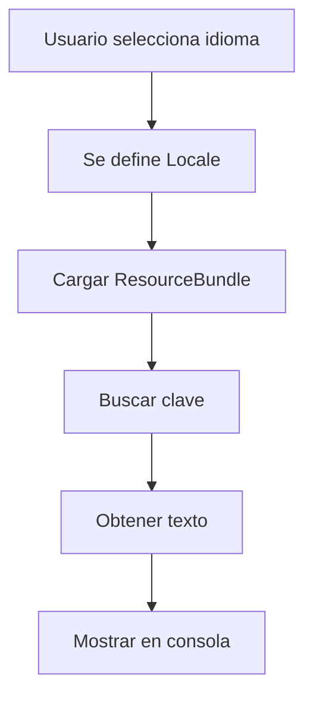

# Sistema de idiomas (i18n) simple

Este proyecto usa `ResourceBundle` de Java para cargar textos desde archivos `.properties` segun el idioma seleccionado. El objetivo es mantener la estructura MVC y centralizar las traducciones en un solo lugar.

**Como funciona**

1. El usuario elige el idioma al inicio.
2. Se define el `Locale` actual.
3. `ResourceBundle` carga `messages_es.properties` o `messages_en.properties`.
4. El menu obtiene los textos por clave con `LanguageManager.get(...)`.

**Ejemplo de uso**

```java
LanguageManager.setLanguage("es");
System.out.println(LanguageManager.get("menu.create"));
```

**Estructura de archivos**

```
src/main/java/util/LanguageManager.java
src/main/resources/messages_es.properties
src/main/resources/messages_en.properties
```

**Diagrama**



**Agregar mas idiomas**

Crea un nuevo archivo `messages_xx.properties` con las mismas claves y usa `LanguageManager.setLanguage("xx")`.
